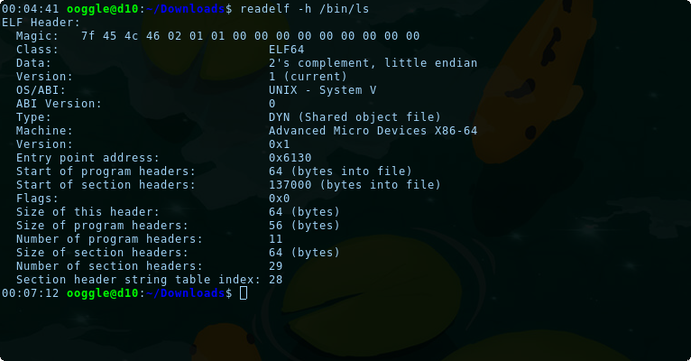

# sELF control (75 pts)


**Description:**

````
I found a program to read the flag but it seems to be broken... Could you help me patching patching two bytes to make it functional ?

Challenge : nc chall0.heroctf.fr 2048

Format : Hero{}
Author : SoEasY
````

**Files:**

[READFLAG](files/READFLAG)

<hr>

In this challenge, we will surely have to deal with some problems with the [ELF format](https://en.wikipedia.org/wiki/Executable_and_Linkable_Format).

First of all, if we try to execute it, we got the following error:
```sh
$ chmod +x READFLAG
$ ./READFLAG
bash: ./READFLAG: cannot execute binary file: Exec format error
```

Let's gather more informations:


that a lot of informations but at a first glance, we can see that the attribute `machine` has been surely replaced by `Intel IA-64`. The [magic](https://en.wikipedia.org/wiki/File_format#Magic_number) is OK.

Let's compare it with an other binary on my system:   


Let's try and change the machine type to match our system ([x86_64](https://en.wikipedia.org/wiki/X86-64)). We will use [GHex](https://wiki.gnome.org/Apps/Ghex) to modify the binary.

this is the header of an ELF file:   


The magic is 16 bytes long, then there is a type who is 2 bytes long, then the machine type, 2 bytes long too. So, we need to edit the value of the machine type at offset 16 (0x12) using this [correspondence table](http://www.sco.com/developers/gabi/latest/ch4.eheader.html).

```css
EM_IA_64	50 (0x32)	Intel IA-64 processor architecture
...
EM_X86_64	62 (0x3E)	AMD x86-64 architecture
```

The new header look like this in hexadecimal:   


Now if we try again to execute our program, we get a segfault:
```sh
$ ./READFLAG 
Segmentation fault
```

It means that our computer has started the program but an error has forced it to stop. Let's open our binary in Cutter to investigate.

After a bit of research based on the header, we spot that the entry point of the program is at 0x10A1 which doesn't match with the [_start label](https://en.wikipedia.org/wiki/Entry_point) who is at 0x10A0 (shift of 1).

In the header, the entrypoint address can be found at offset 24 (0x18), we need to change the value from 0x10A1 to 0x10A0.
Here is the new content of out header:   


Now, when we try to execute the program, there is no more crashes!

We can then submit our modifications to the server:   


Here is the flag!

Flag: `Hero{W0w_s0_y0u_4r3_4n_ELF_h34d3r_M4sT3r???}`

Author: Ooggle
