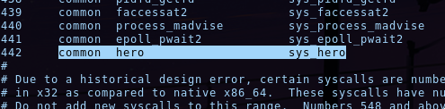

# Ring0 Calling (100 pts)


**Description:**

````
I like to compile my kernels. And I like to do it the old way.
And I also like doing it 50x times because I forgot an option.

Can you get the flag ?

ssh -p 4822 ring0@ai.heroctf.fr
password : ring0_lol

Format : Hero{}

Authors : SoEasY & iHuggsy
````

<hr>

First, we need to connect to the machine via ssh and run the machine with the custom kernel via `./run`.

Since this is a very minimal machine (not even a /lib folder), a share is mounted at `/mnt/share` in order to share files with the target machine.

With a quick look, we find the file `/BACKUP/syscall_64.tbl`, and we can see something interesting inside:   


This is the list of the [syscalls](https://en.wikipedia.org/wiki/System_call) on the machine. Sys_hero seems to be a newly added syscall.

Therefore, we can make a simple program in C to call this custom system call.

`syscall.c`
```c
#include <sys/syscall.h>
#include <stdio.h>

int main(int argc, char *argv[])
{
    long ret = 0;
    ret = syscall(442);

    printf("ret: %ld\n", ret);

    return 0;
}
```

We need to compile it in a static way since there is no /lib folder:
```sh
$ gcc syscall.c -o syscall -static
```

Then, we can test it on the target machine:
```sh
ring0@ai.heroctf.fr# ./run

root:/# cd /mnt/share
root:/mnt/share# ls
syscall
root:/mnt/share## chmod +x syscall
root:/mnt/share# ./syscall
ret: 0
```

The syscall returned 0, so there was no errors.

Let's check kernel logs:
```sh
# dmesg
...
[  119.928808] Hero{0h_d4mn_y0u_4r2_th3_sysc4llm4st3r!!!}
```

Here is the flag!

Flag: `Hero{0h_d4mn_y0u_4r2_th3_sysc4llm4st3r!!!}`

Author: Ooggle
