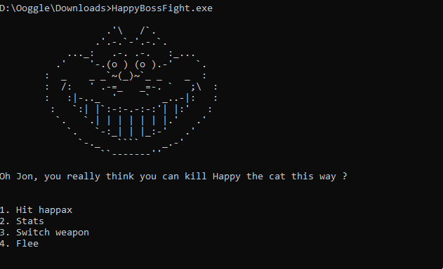
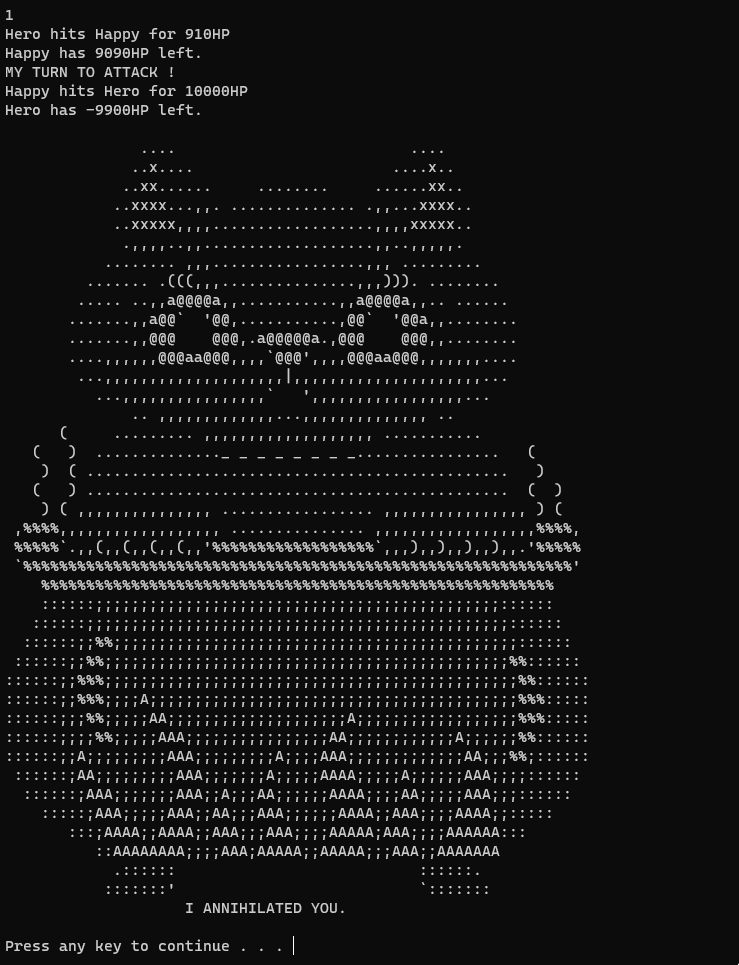
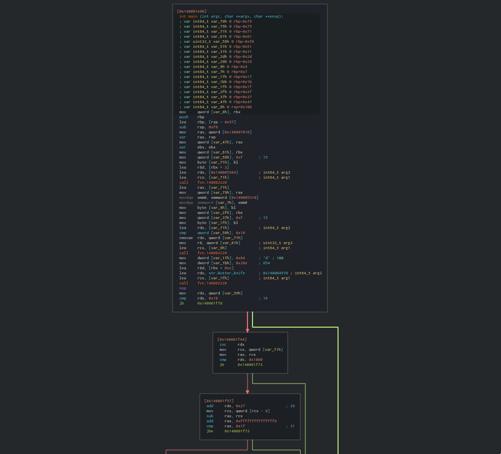
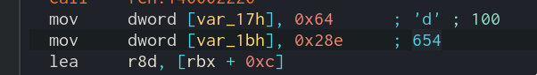
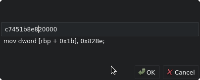
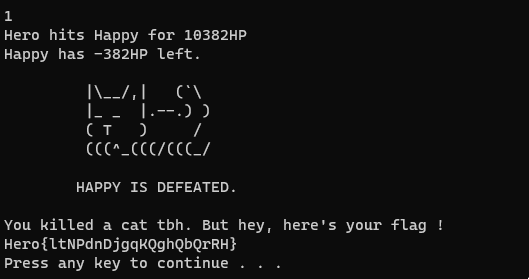

# Happy the Boss (75 pts)


**Description:**

````
Happy the cat is the worse boss you'll ever face.
Game is harder than Darksouls.

What do we say already ? GIT GUD ?.

Oh btw, check the category well ! ;)
Format : Hero{}

Author : iHuggsy
````

**Files:**

[HappyBossFight.exe](files/HappyBossFight.exe)

<hr>

So, we have a PE executable here. Let's first execute it and see what we got:   


If we try to hit our dear Happax, here's what we have:   


We hit him with 654 damage. Remember well this number, it will be useful in a few minutes.

After dealing with our damage, the cat kill us and the program stop.

Quick review of the other options:
- 2. Stats: give us our stats, not very useful though.
- 3. Switch weapon: add a few damages to our weapon, it can maybe be used to up our damages until we can one shot Happax (but I'm lazy).
- 4. Flee: quit the program.

Let's have a basic check of the reversed binary's main function:   


Without even trying to understand the program, we can see space in memory (var_1bh) set to the value of our damage:   


We try to modify this value to something greater to check if there is any modification protection in the program:   


Let's see what we get now:   


Here is the flag!

Flag: `Hero{ltNPdnDjgqKQghQbQrRH}`

Author: Ooggle
