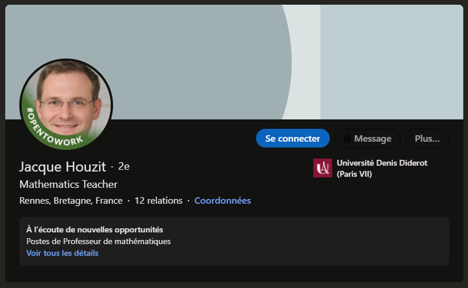
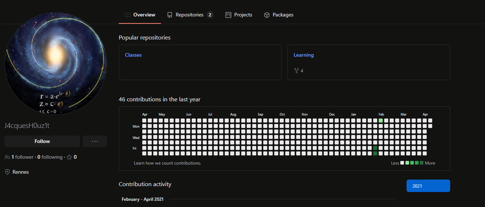
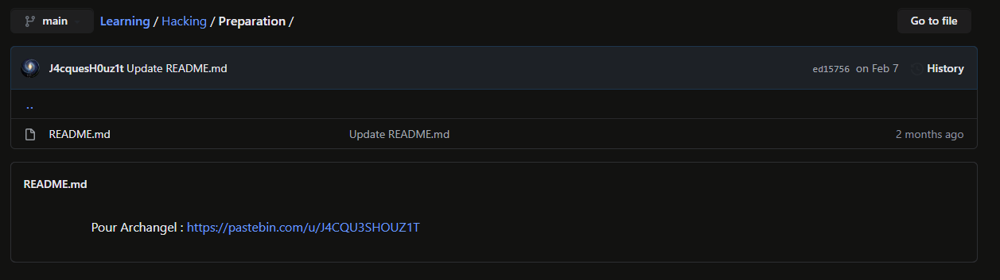
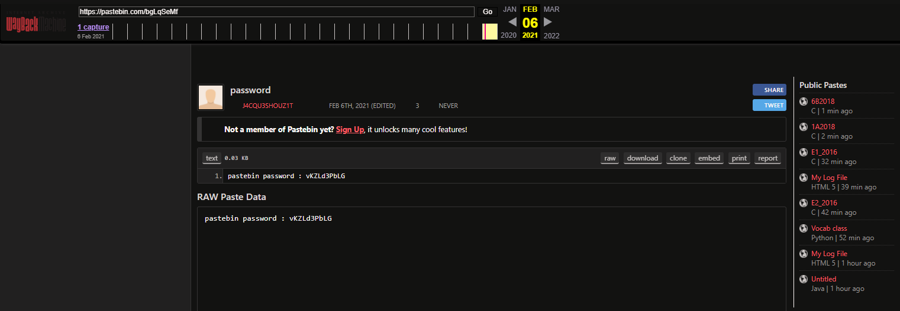

# Back to the past 1/3


````
Le lycée Jeanne d'Arc a récemment licencié Jacque Houzit, un professeur de Mathématiques. Ils le suspectent de préparer une attaque informatique contre eux pour se venger.

Ils font appel à vos services, enquêtez et voyez ce que vous pouvez trouver.

Format : MCTF{}
````

The first challenge of OSINT asks us to find information about a computer attack made by a teacher who was fired from a high school. 

A quick google search allows me to find a Linkedin profile corresponding to this information.



By inspecting this profile, I find in his coordinates the link of his Linkedin profile as well as his github profile.



His github contains two repositories: "Classes" and "Learning", going to learning we discover several folders and notice Hacking/Preparation in which is stored a Readme.md with a link to a pastebin.



This pastebin needs a password to unlock, I think to go on waybackmachine to check if this pastebin has always needed a password (title of the challenge also refers to it : back to the past)

A save is available on february 6th, it contains a file with a password : "vKZLd3PbLG".



Going back to the pastebin, I use the password to unlock the content of the file:

```
Rendez-vous demain 14h à Rennes place de la République (n'oublie pas ton Pineapple).

MCTF{4lw4S_l00k_4t_Th3_P4sT}
```

We can retrieve the flag and validate the challenge

