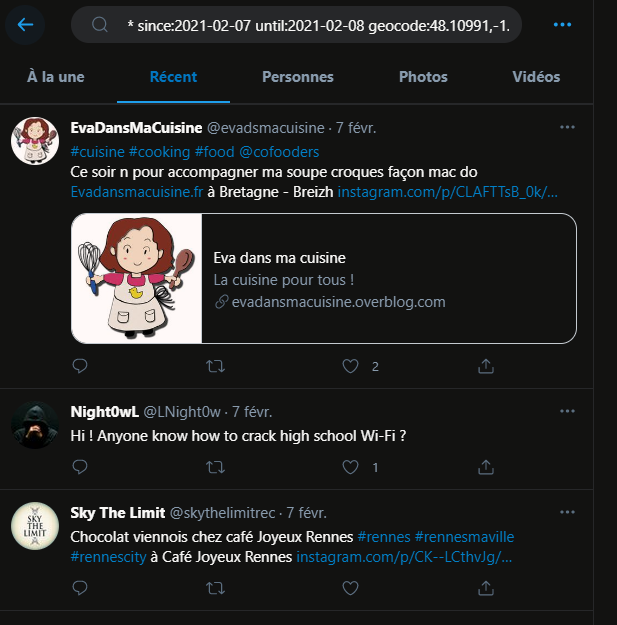

# Back to the past 2/3

````
Grâce à vos informations, le directeur du lycée a pu retrouver Jacque Houzit en consultant l'historique des caméras de la ville de Rennes.

Il agissait bizarrement et était constamment sur son téléphone. Avec les informations que vous avez récoltées, faites votre possible pour retrouver son compte Twitter.

Format : MCTF{NomUtilisateur}
````

The challenge asks us to find the twitter ID of his account. I'm going to make a search on the social network with the information obtained during the previous challenge:

Place : "Place de la République" in Rennes

Date : february 7th (pastebin created on february 6th with the date of the meeting : tomorrow)

First step, get the geocode of the "place de la République" in Rennes to locate the message : 48.10991,-1.67827

I go on twitter and make my research:



````
* since:2021-02-07 until:2021-02-08 geocode:48.10991,-1.67827,1km
````

Bingo, three tweets stand out including one from: [@LNight0w](https://twitter.com/LNight0w) asking about WiFi hacking.

So I have the second flag: MCTF{LNight0w}

