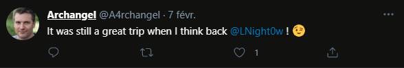
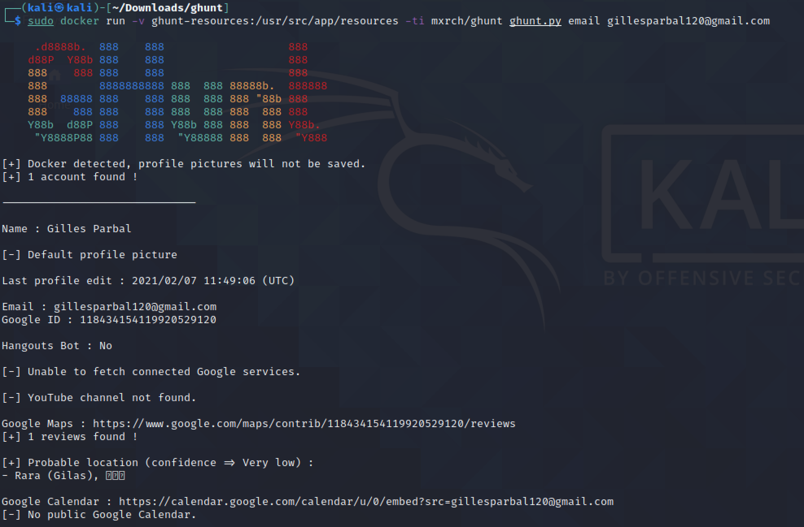
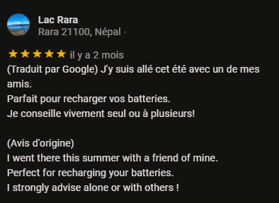

# Back to the past 3/3

```
Jacque Houzit a été licencié car il consommait du cannabis sur son lieu de travail. Le directeur du lycée le suspecte de s'être fourni sur une plaque tournante à l'étranger.

Retrouvez dans quel pays il est parti cet été.

Format : MCTF{Pays}

Attention, seulement 3 essais sont autorisés
```

I continue my research on the twitter profile of [@LNight0w](https://twitter.com/LNight0w) and I realize that he has only 1 subscriber who is [@A4rchangel](https://twitter.com/A4rchangel) :


First interesting thing is a pinned tweet containing his gmail address:


Then going back through all his tweets I come across a travel talk with [@LNight0w](https://twitter.com/LNight0w) :



I now know that they went on vacation together and so I started to search on instagram and facebook if Gilles Parbal published pictures of his trips. Without success, I don't find any corresponding account. I think then to check if he has published a review on google maps since he was on a trip. And his mail account is a gmail account.

To do this I use the tool [GHunt](https://github.com/mxrch/GHunt) to save time with this task.



It found a review on google maps:



All the informations are there : travel with a friend this summer, and the country : Nepal

Here is the final flag : MCTF{Nepal}